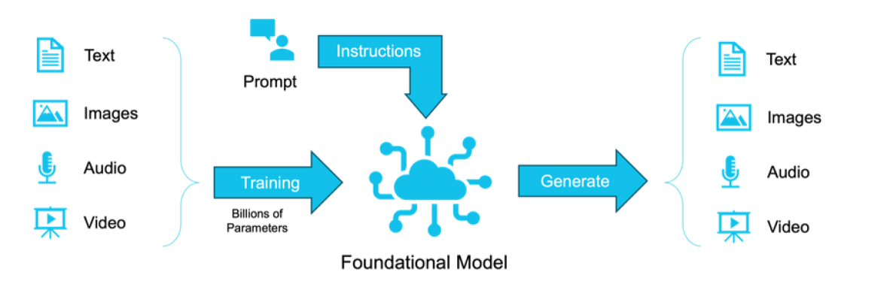
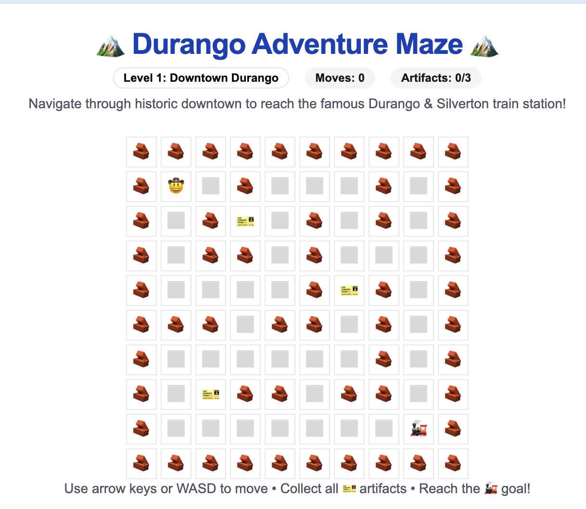
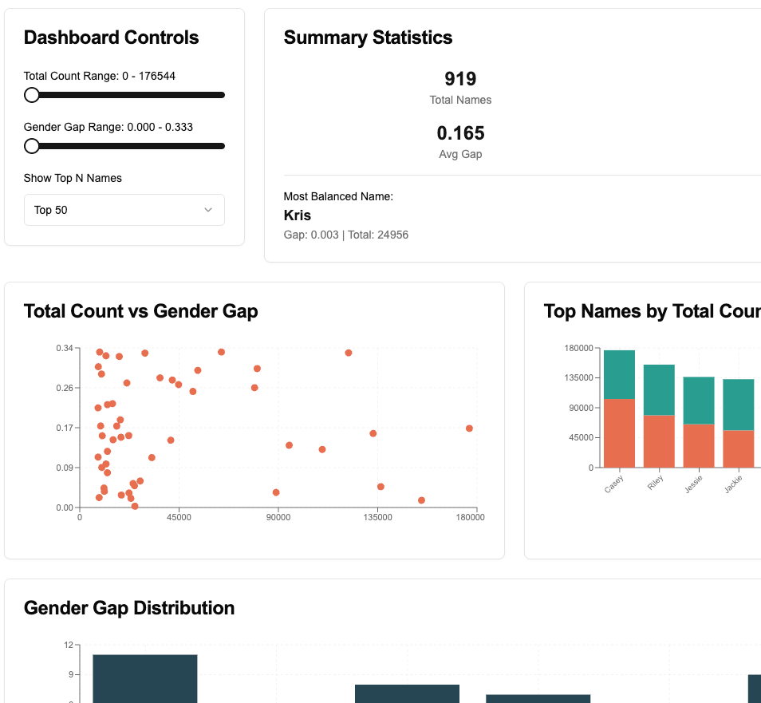
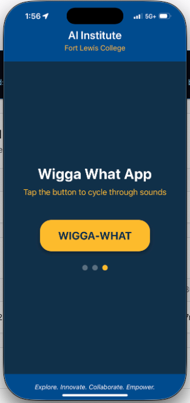

<!-- 
_class: lead
_paginate: false
-->

# Building Apps using AI

**Community Workshop**

Fort Lewis College AI Institute

June 24, 2025 | 6:00 - 7:30 PM

---

# Welcome!

**Nicholas Goodman**  
Fort Lewis College AI Institute

CTO at Signify (AI-Powered Compliance)  
Advisor/investor to 12+ Startups

**What do you want to learn?**

- Slides/Info
- Hands-on demonstrations
- Real-world examples

---

# Agenda

1. 🌍Landscape of Generative AI█████5m
1. 🤖AI Assisted Building Apps██████████10m
1. ✨Examples██████████10m
1. 🛠️Build Together (App + Website)████████████████████20m
1. 💻Hands-on Activity████████████████████20m
1. 💬Wrap and Q&A██████████10m

  

  

  

  

  

  

---

# The Landscape of Generative AI

---

# The Landscape of Generative AI (cont'd)

  

    
    
Stochastic Parrots: Pattern matching & repetition

  

  

    
    
Reasoning Systems: Problem-solving & logic

  

---

# AI assisted building apps

## Rapid prototyping

- Quick screen iterations
- Painted door prototypes
- Should this be built?
- Generate "living spec" for IT

graph TD
    A[Idea] --> B[Build]
    B --> C[Review]
    C -->|chat in seconds| A

## Applications

- Internal Tools
- Code generation
- Test suite
- Synthetic data for testing
- Auto-documentation

graph TD
    AI[AI Coding]
    AI --- A[Internal Tools]
    AI --- B[Code generation]
    AI --- C[Test suite]
    AI --- D[Synthetic data for testing]
    AI --- E[Auto-documentation]

---

# AI assisted building apps (cont'd)

## What options are available today?

### No-code / Low-code
- Lovable ([https://loveable.dev](https://loveable.dev))
- Bolt ([https://bolt.new](https://bolt.new))
- Replit ([https://replit.com](https://replit.com))
- V0 ([https://v0.dev/](https://v0.dev/))
- Many more...

### IDEs
- Cursor ([https://cursor.com](https://cursor.com))
- Windsurf ([https://windsurf.com](https://windsurf.com))
- Zed ([https://zed.dev](https://zed.dev))
- Trae ([https://trae.ai](https://trae.ai))
- More not listed here...

### VSCode extensions:
- Github Copilot
- Cline ([https://cline.bot](https://cline.bot))
- Roo Code ([https://roocode.com](https://roocode.com))
- Kilocode ([https://kilocode.ai](https://kilocode.ai))
- Augment ([https://augmentcode.com](https://augmentcode.com))
- More not listed here...

### Command line / Terminal tools:
- Claude Code ([https://www.anthropic.com/claude-code](https://www.anthropic.com/claude-code))
- OpenAI's Codex ([https://openai.com/codex/](https://openai.com/codex/))
- Aider ([https://aider.chat](https://aider.chat))

---

# AI assisted building apps (cont'd)

## Strategies and Tips
- Small bite size projects with specific instructions
- Think of agents like an eager, talented, but slightly naive intern
- Connection and infrastructure still a PITA
- Bigger projects experiment with Claude Flow / Task Master
- MCP is your friend

---

# Examples : V0 - Durango Adventure Maze

**Try it:** [v0-new-project-upeckp5jro9.vercel.app](https://v0-new-project-upeckp5jro9.vercel.app/)

**Prompt:**  
*"Create a small maze game, that has 3 levels... take an inspiration from Durango, CO and name the things and icons in the game associated with town of Durango, CO"*

**Auto-generated features:**
- 3 themed levels (Downtown, Mesa Verde, Animas River)
- Full keyboard controls (WASD/arrows)  
- Collectible artifacts system
- Red rocks as obstacles
- Train station as goal
- Move counter & level progression
- Responsive design
- Sound effects & animations

**Creation time:** ~30 seconds → **Fully playable game!**  
**Cost:** $0.06

---

# Examples: V0 - Unisex Names Dashboard

**Try it:** [v0-unisex-names.vercel.app](https://v0-unisex-names.vercel.app/)

**Prompt:**  
*"Build a dashboard style app with flexible nice grids, with at least 2 or three interactive inputs (dials, selectors, ranges, whatever you choose) that displays 3-4 interesting visualizations for the unisex data."*

**Auto-generated features:**
- Interactive year range selector (1880-2022)
- Name popularity threshold slider
- Gender balance filter
- Line chart showing trends over time
- Bar chart for top names by decade
- Scatter plot for gender distribution
- Responsive grid layout
- Real-time data filtering

**Creation time:** ~3 minutes (with two follow-ups) → **Full dashboard!**  
**Cost:** $0.24

---

# Examples: Roo - Expo Go Wigga What

**Try it:** Expo Go App  
(iOS/Android)

**Prompt:**  
*"Create a new expo go app (use context7 for specifics), named wigga-what. For now it just has a three button app that cycles through wigga, what, then wigga-what with a haptic device buzz. Initialize all the boilerplate code, use colors and styles from this site here: https://ai.fortlewis.edu/"*

**Auto-generated features:**
- Complete Expo project setup
- State cycling (wigga → what → wigga-what)
- Haptic feedback on button press
- FLC AI Institute branding/colors
- iOS/Android compatible

**Creation time:** ~2 minutes → **Native mobile app!**  
**Cost:** $0.71

---

# AI Assisted Building Apps (cont'd): Website Demo

[https://website-idea-generator.netlify.app/](https://website-idea-generator.netlify.app/)

---

# AI Assisted Building Apps (cont'd): App Demo 

[https://appideagenerator.com/](https://appideagenerator.com/)

---

# Hands-on Activity (20min)

1. Go to v0.dev (signup for vercel, free account, verify email)

## Choices

1. Download data from https://github.com/fivethirtyeight/data/tree/master and make an interesting application (quiz, analysis, etc)
1. Create a full website for an invented Durango business (bonus points for humor)
1. Make a little game (asteroids, maze, centipede, mario bros/lode runner, etc)

---

# Wrap and Q&A

1. Thoughts?
1. Be cautious (don't deploy these without professionals)
1. Be creative
1. Questions?

---

<!-- _class: lead -->

# Questions and Answers

Thank you for joining!

The Center for Innovation
835 Main Ave, Suite 225

---

# Wrap 

- Slides: [GitHub Pages URL]
- Code examples: [This repository]
- Contact: [Your info]

---

# Free Community Workshop

---

# Appendix: MCP (Model Context Protocol)

## MCP Server Examples

### Official Servers
- **filesystem** - File operations
- **github** - GitHub API access
- **google-drive** - Google Drive integration
- **postgres** - PostgreSQL databases
- **sqlite** - SQLite databases
- **slack** - Slack messaging
- **puppeteer** - Browser automation
- **fetch** - HTTP requests

### Community Servers
- **supabase** - Supabase backend
- **figma** - Figma design files
- **notion** - Notion workspace
- **linear** - Linear issue tracking
- **obsidian** - Obsidian notes
- **spotify** - Spotify control

## How MCP Enhances AI Coding

graph LR
    A[AI Assistant]
    B[MCP]
    C[Files]
    D[GitHub]
    E[Database]
    F[APIs]
    G[IDE]
    H[Design]
    A --> B
    B --> C
    B --> D
    B --> E
    B --> F
    B --> G
    B --> H

